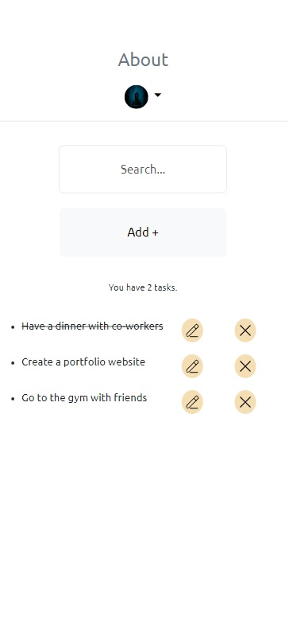
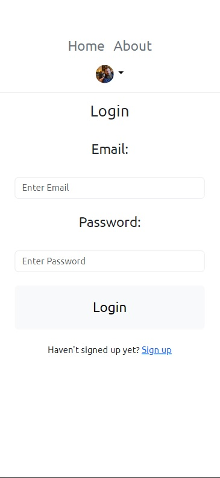
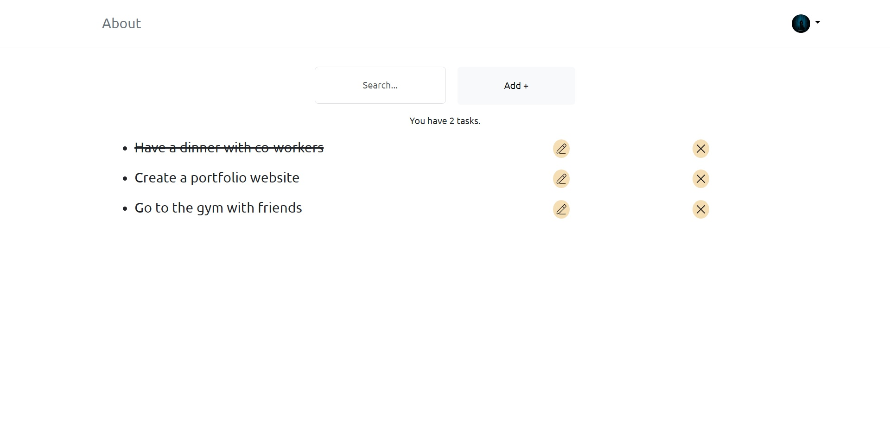
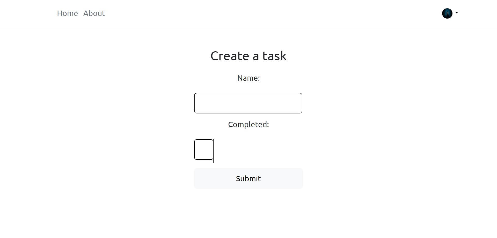
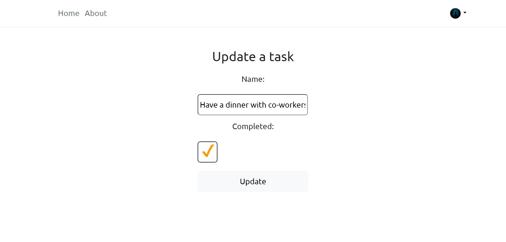
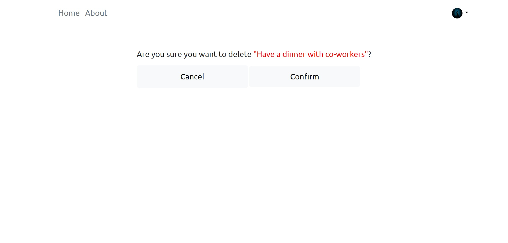
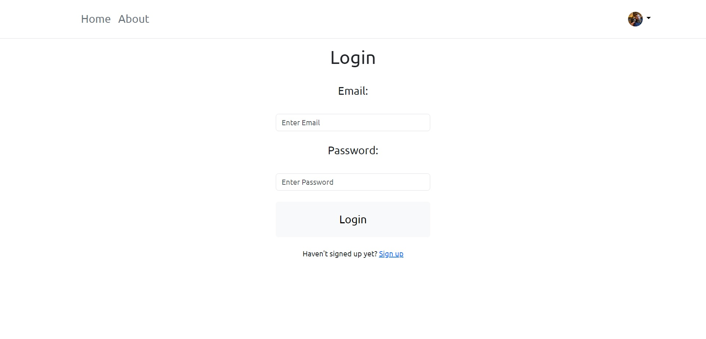
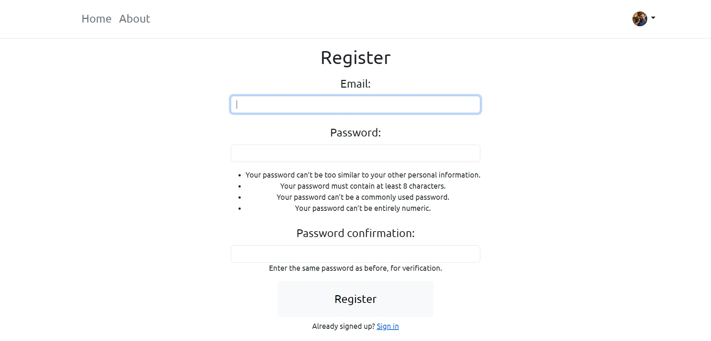
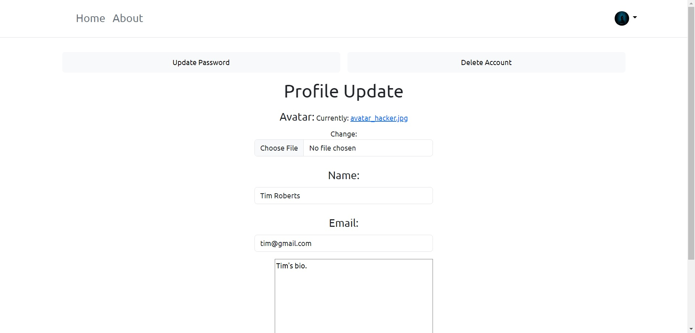

# To-do-list app created with Django FBV

To run the app do the following:
1. Clone the project
2. Get requirements
3. Delete db.sqlite3 and 0001_initial.py (migrations) if these files are present
4. Make sure you have local Postgresql installed
5. Create .env file and write down all Postgresql credentials

Then run next commands:
1. python manage.py make migrations
2. python manage.py migrate
3. python manage.py createsuperuser
4. python manage.py runserver

## Table of contents

- [Overview](#overview)
  - [The challenge](#the-challenge)
  - [Screenshot](#screenshot)
  - [Links](#links)
- [My process](#my-process)
  - [Built with](#built-with)
  - [What I learned](#what-i-learned)
  - [Continued development](#continued-development)
  - [Useful resources](#useful-resources)
- [Author](#author)
- [Acknowledgments](#acknowledgments)

## Overview

### The challenge

Users should be able to:

- View the optimal layout depending on their device's screen size
- See hover states for interactive elements

- See a list of all tasks
- See a number of incomplete tasks
- Add a task
- Update a task
- Delete a task
- Register
- Login
- Update Profile
- Update Password
- Delete Profile

### Screenshot

<p float="left">
  
  
  
  
  
  
  
  
  
</p>

### Links

- Repository URL: [Add solution URL here](hhttps://github.com/coder-96/to-do-list-django-fbv)

## My process

### Built with

Frontend:
- HTML5
- CSS
- Flexbox, CSS Grid
- Bootstrap 5

Backend:
- Django Framework 4.2.6
- Postgresql

### What I learned

Improved my CRUD skills once again, and gained more knowledge overall on Python, Django.

```python
@login_required(login_url="login")
def home(request):
    q = request.GET.get("search-input") if request.GET.get("search-input") is not None else ""
    todos = Todo.objects.filter(
        Q(name__icontains=q) |
        Q(name__startswith=q)
    )
    count = Todo.objects.filter(user=request.user, completed=False).count()
    context = {"todos": todos, "count": count, "page": "home"}
    return render(request, "firstapp/index.html", context)
```

### Continued development

I'm focused on perfecting my Django, Flask skills by building more projects.

### Useful resources

- [MDN Web Docs](https://developer.mozilla.org/en-US/) - helped me find answers when I got stuck.

## Author

- Website - [Jalga](https://github.com/coder-96)

## Acknowledgments

I thank my family for supporting me on my way to becoming a Developer. 